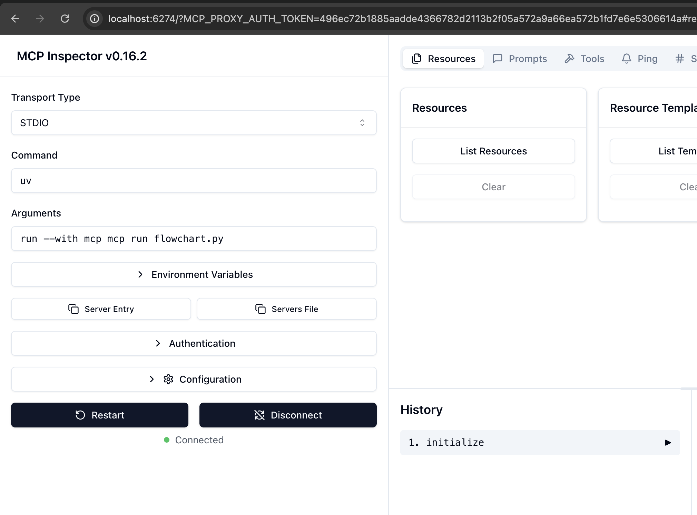
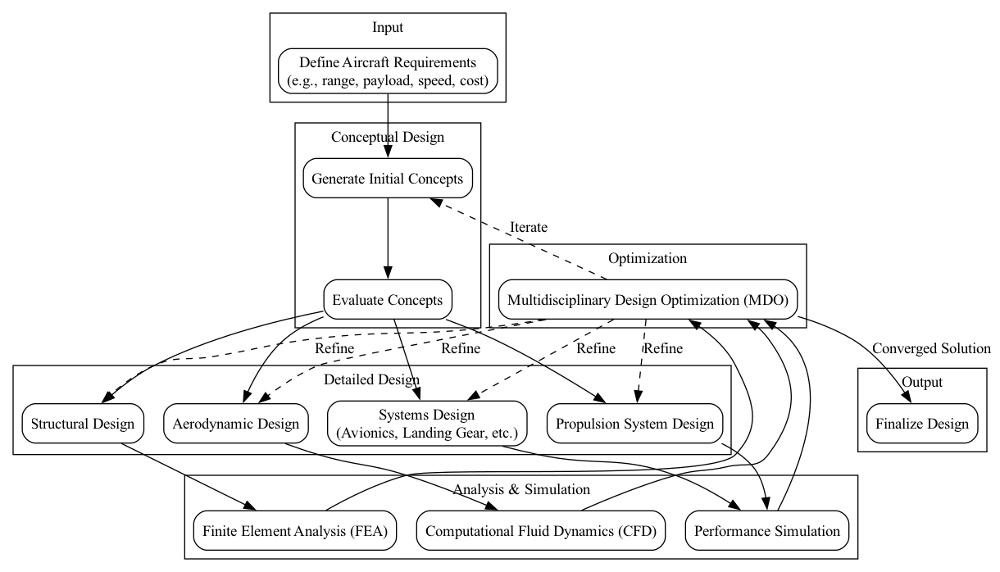

# MCP Server Experiments

This repository contains two example projects:

- **flowchart-gen**: Generates Graphviz flowcharts from input data in the DOT format.
- **weather-example**: Demonstrates a simple weather server using the Model Context Protocol (MCP).

## Setup Instructions

### 1. Clone the Repository
```bash
git clone <repo-url>
cd mcp-server-experiments
```

### 2. Setup and Run Each Project

#### For `flowchart-gen`:
```bash
cd flowchart-gen
python3 -m venv .venv
source .venv/bin/activate
pip install -r requirements.txt
```

#### For `weather-example`:
```bash
cd weather-example
python3 -m venv .venv
source .venv/bin/activate
pip install -r requirements.txt
```

you may also have to install mcp

```bash
pip install "mcp[cli]"
```

### 4. Run the Development Server

```bash
mcp dev flowchart.py   # For flowchart-gen
mcp dev weather.py        # For weather-example
```

You may need to adjust the **command** and **argument** fields before connecting to the server - It works with the setup depicted below:



### 5. Configure Gemini CLI
Update your `~/.gemini/settings.json` to point to your local server as described in the [MCP Quickstart](https://modelcontextprotocol.io/quickstart/server).

If gemini makes a flowchart the image will appear in `\flowchart-gen` as `flowchart.png`:

